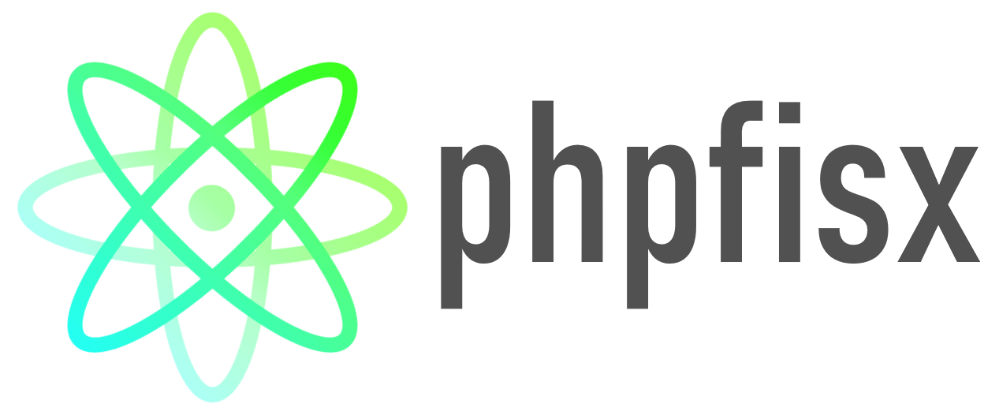

# phpfisx — PHP Physics Engine

[](https://github.com/d4rkd0s/phpfisx/actions/workflows/ci.yml)
[](https://www.php.net/)
[](LICENSE)

A 2D physics simulation engine written in PHP — because why not.

Runs locally with just `php -S` and a browser. No compilation, no external services, no WebGL. Pure PHP + HTML5 canvas playback.


---

## Features

- **Position-Based Dynamics** — distance constraints hold rigid bodies together across multiple solver iterations per step
- **Rigid bodies** — spawn boxes and circles; each shape is a network of PBD constraints with mass-weighted correction
- **Point-vs-edge collision** — loose particles bounce off shape surfaces with configurable restitution (bounciness)
- **Elastic point-point collision** — mass-weighted impulse response between particles
- **Gravity + custom forces** — directional force with magnitude and degree-based direction
- **Friction / velocity damping** — per-field drag coefficient applied each step
- **Interactive control panel** — sliders for gravity, friction, bounciness, particle count, and step count
- **Animated canvas playback** — pre-baked PNG frames played back in-browser with play/pause/scrub
- **PSR-4 autoloading**, PHP 8.1+, Pest test suite, GitHub Actions CI

---

## Quickstart

```bash
# Clone and install
git clone https://github.com/d4rkd0s/phpfisx
cd phpfisx
composer install

# Run the dev server
php -S localhost:8000

# Open in browser
open http://localhost:8000
```

**Requirements:** PHP 8.1+ with `ext-gd` enabled, Composer.

**Got Yarn?**
```bash
yarn start   # starts php -S localhost:8000
```

---

## How It Works

Each simulation is a **field** containing **points** (particles) and optional **constraints** (rigid body edges).

**Physics loop per step:**
1. Apply turbulence (random micro-forces to loose particles)
2. Apply gravity (downward force, scaled by mass)
3. Resolve point-point collisions (elastic impulse)
4. Resolve point-vs-edge collisions (impulse vs rigid body surfaces)
5. Integrate velocity → position (with wall reflection + friction)
6. Solve PBD constraints (N iterations — keeps rigid bodies stiff)
7. Feed constraint position deltas back into velocity

The full simulation is pre-calculated server-side, then each frame is rendered to a PNG via PHP GD and base64-encoded into a self-contained HTML page with a canvas player.

---

## Architecture

```
phpfisx/
├── phpfisx/
│   ├── areas/
│   │   └── field.php          # Simulation space, physics loop, rendering
│   └── entities/
│       ├── point.php           # Particle — position, velocity, mass, integrate
│       ├── constraint.php      # PBD distance constraint (boundary or internal)
│       ├── vector.php          # 2D vector math
│       └── line.php            # Line segment entity
├── tests/Unit/                 # Pest test suite (48 tests)
├── render.php                  # HTTP endpoint — runs sim, returns animated HTML
├── index.php                   # Control panel UI
├── boot.php                    # Composer autoload bootstrap
└── composer.json
```

---

## Reporting Issues

Use the [GitHub issue tracker](https://github.com/d4rkd0s/phpfisx/issues/new/choose) — select **Bug** or **Feature**.

---

## Roadmap

- [x] 2D Fields with bounds
- [x] 2D Points (particles)
- [x] 2D Gravity
- [x] 2D Custom forces
- [x] 2D Velocity system
- [x] 2D Friction / velocity damping
- [x] 2D Mass + inertia
- [x] 2D Point-to-point elastic collision
- [x] 2D Rigid bodies (boxes + circles via PBD constraints)
- [x] 2D Point-vs-edge collision with restitution
- [x] 2D Disk-persisted simulation state
- [x] 2D Animated canvas playback
- [ ] 2D Static collision surfaces (immovable walls/ramps)
- [ ] 2D Scene editor (visual placement of shapes)
- [ ] 2D Materials (per-shape restitution + friction)
- [ ] Live unstepped simulation
- [ ] 3D Spaces
- [ ] 3D Points, Lines, Polygons
- [ ] 3D .stl / .obj import

---

## License

[MIT](LICENSE) — Logan Schmidt
